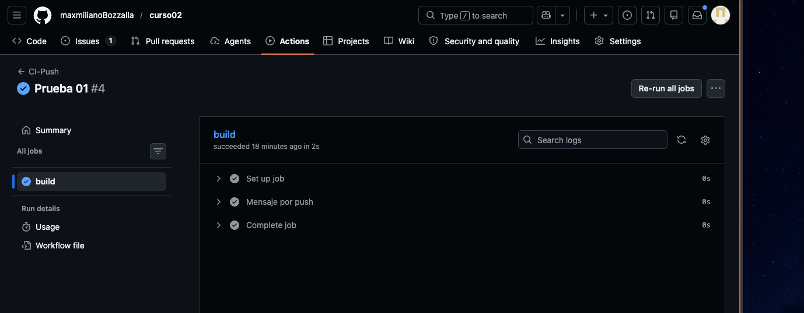
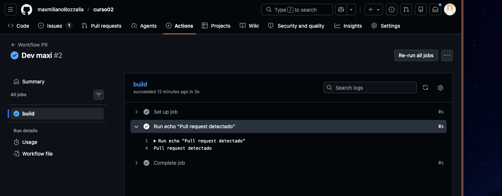
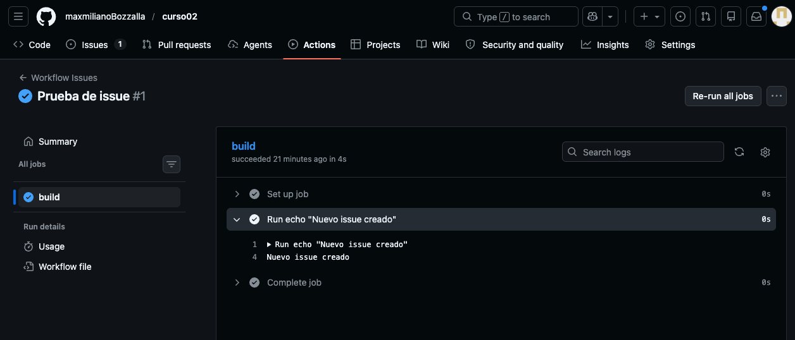
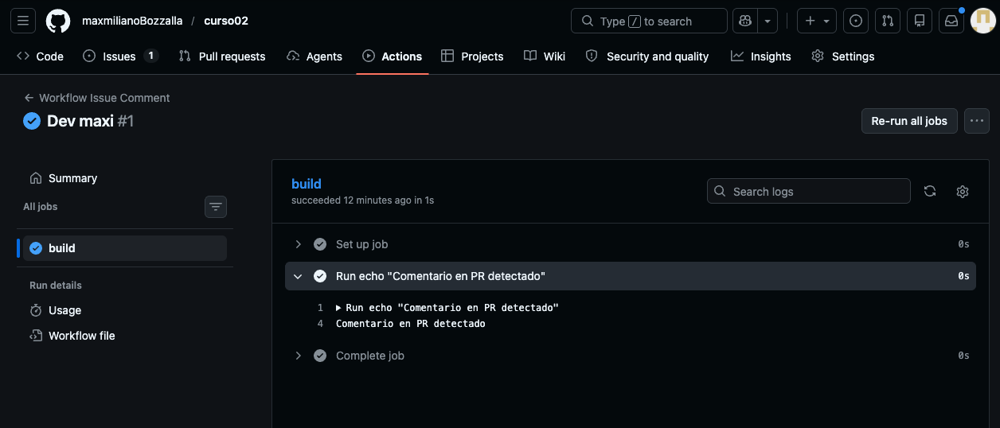
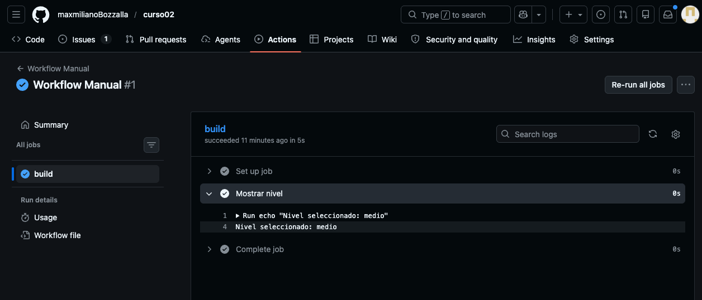
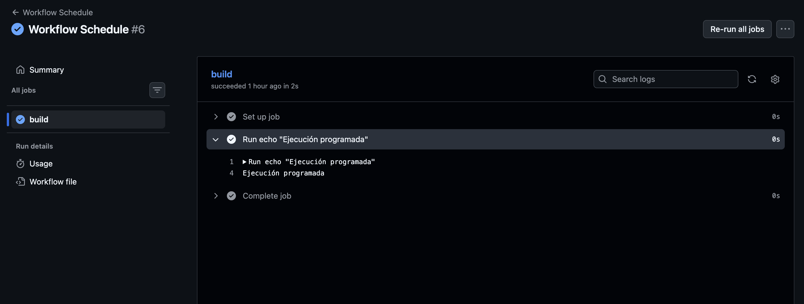

📌 Nombre

Automatización de workflows con GitHub Actions

⚙️ Descripción de los workflows

El proyecto implementa distintos workflows utilizando GitHub Actions, cada uno asociado a un evento específico del repositorio.

🔹 Workflow 1: push

Se ejecuta cuando se realiza un push a la rama main.
Imprime el mensaje:
Workflow activado por push

🔹 Workflow 2: pull_request

Se ejecuta cuando se crea o actualiza un Pull Request hacia la rama main.
Imprime el mensaje:
Pull request detectado

🔹 Workflow 3: issues

Se ejecuta cuando se crea un nuevo issue en el repositorio.
Imprime el mensaje:
Nuevo issue creado

🔹 Workflow 4: issue_comment

Se ejecuta cuando se realiza un comentario.
Está configurado para ejecutarse únicamente cuando el comentario pertenece a un Pull Request.
Imprime el mensaje:
Comentario en PR detectado

🔹 Workflow 5: workflow_dispatch

Permite ejecutar el workflow manualmente desde GitHub.
Incluye un input de tipo choice (nivel de alerta: bajo, medio o alto).
Imprime el valor seleccionado por el usuario.

🔹 Workflow 6: schedule

Se ejecuta automáticamente en intervalos de tiempo definidos (cron).
En este caso, se configuró para ejecutarse periódicamente.
Imprime el mensaje:
Ejecución programada

## 📸 Evidencias de ejecución

### ✔ Workflow push

### ✔ Workflow pull_request

### ✔ Workflow issues

### ✔ Workflow issue_comment

### ✔ Workflow workflow_dispatch

### ✔ Workflow schedule
